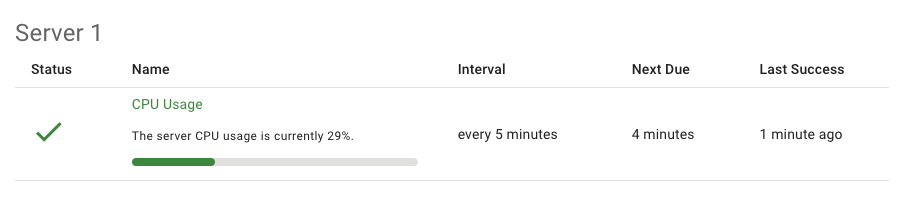

# Status Monitor

<https://status-monitor.app>

Send alert notifications when a successful "ping" isn't received within a specified interval of time.

Useful when you have hundreds of automated reports and processes and can't afford to be the last one to know that it has stopped working.

Use your API key to post JSON to the endpoint: `https://status-monitor.app/api/ping`.

```bash
curl -d '{"name": "Test Ping","groupName": "Test Group","details": "Some test info with **markdown** formatting.","interval": 10,"apiKey": "**APIKEY HERE**","progressBar": 33,"success": true,"emails": ["example@fakeemail.com"]}' -H "Content-Type: application/json" -X POST https://status-monitor.app/api/ping
```

| Property        |                     | Description                                                                                                           |
| --------------- | ------------------- | --------------------------------------------------------------------------------------------------------------------- |
| **name**        | `string` required   | Used in combination with `groupName` to uniqely identify the report type.                                             |
| **groupName**   | `string` required   | Used in combination with `name` to uniqely identify the report type.                                                  |
| **tag**         | `string` optional   | Additional property to display in reports.                                                                            |
| **details**     | `string` optional   | To add helpful details from your application to display in the reports.                                               |
| **interval**    | `number` required   | Number in **minutes** that the next ping with `success` must be received to avoid `failed` status.                    |
| **apiKey**      | `string` required   | You can create and delete multiple `apiKey` in your organization.                                                     |
| **progressBar** | `number` optional   | Optionally display a progress bar. Set to `0-100` or `null` This is useful for displaying CPU usage or disk capacity. |
| **success**     | `boolean` optional  | Default is `true`. When `false` the monitor will behave the same as never receiving a ping and trigger notifications. |
| **emails**      | `string[]` optional | Array of email addresses that should recieve notification when monitor doesn't receive a `success=true` ping.         |


